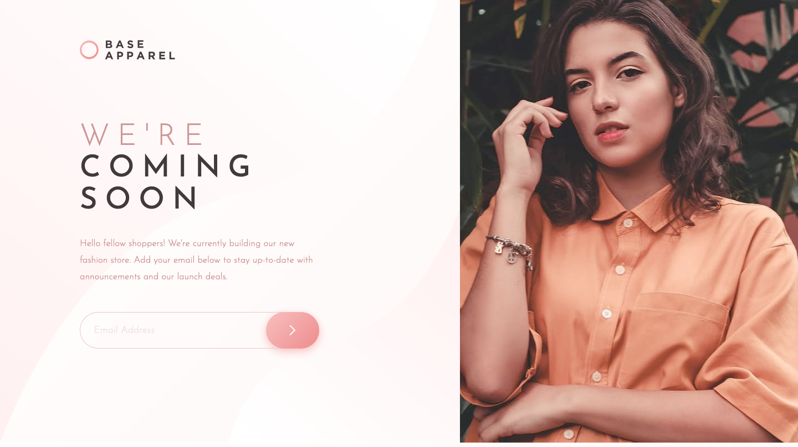
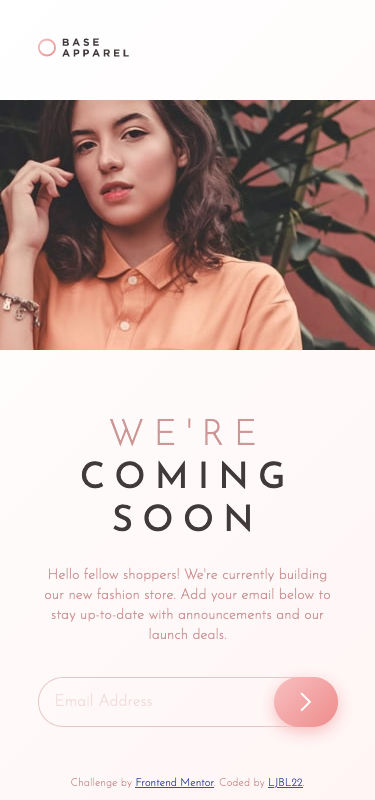

# Frontend Mentor - Base Apparel coming soon page solution

This is a solution to the [Base Apparel coming soon page challenge on Frontend Mentor](https://www.frontendmentor.io/challenges/base-apparel-coming-soon-page-5d46b47f8db8a7063f9331a0).

## Table of contents

- [Overview](#overview)
  - [The challenge](#the-challenge)
  - [Screenshot](#screenshot)
  - [Links](#links)
- [My process](#my-process)
  - [Built with](#built-with)
  - [What I learned](#what-i-learned-or-practised)
  - [Continued development](#continued-development)
  - [Useful resources](#useful-resources)
- [Author](#author)
- [Acknowledgments](#acknowledgments)

## Overview

### The challenge

Users should be able to:

- View the optimal layout for the site depending on their device's screen size
- See hover states for all interactive elements on the page
- Receive an error message when the `form` is submitted if:
  - The `input` field is empty
  - The email address is not formatted correctly

### Screenshot

### Links

- Solution URL: [FEM discussion](https://www.frontendmentor.io/solutions/rwd-page-with-email-validation-OInnMUtyb6)
- Live Site URL: [DEMO](https://ljbl22.github.io/frontend-mentor/base-apparel-coming-soon-master/)

## My process

(5hrs)

- start from mobile 375px layout
- tuning font-size and tiny tweaks
- following focus on desktop layout
- svg on button by img

(2hrs)

- email validation style
- email validation with HTML, then with javascript

(7hrs in total)

### Built with

- Semantic HTML5 markup
- CSS custom properties
- Mobile-first workflow
- vanilla JavaScript

### What I learned or practised

CSS

- placeholder style
- em usage
- linear-gradient
- difference between `visibility: hidden` and `display: block`
- center footer
- **updated** Utilize the `text-indent` property to conceal the text that should remain hidden

HTML

- picture & srcset

  - **updated** after reviewing other peers' works, replaced with a `div` using `background-image` to achieve RWD

- email validation by input pattern
- **updated** should include a value on the input button to enhance accessibility [ref](https://dequeuniversity.com/rules/axe/4.6/input-button-name?application=axeAPI)
- **updated** keep the structure inside landmarks, e.g. `header` `nav` `main` `footer` [ref](https://dequeuniversity.com/rules/axe/4.6/region?application=axeAPI)

JavaScript

- email validation

### Continued development

- RWD Mostly Fluid layout
- Improve my speed of layout, keep practicing!

### Useful resources

- MDN [**Client-side form validation**](https://developer.mozilla.org/en-US/docs/Learn/Forms/Form_validation)

- [RegExp.prototype.test()](https://developer.mozilla.org/en-US/docs/Web/JavaScript/Reference/Global_Objects/RegExp/test)

## Author

- Website - [LJBL-REPO](https://github.com/LJBL22/frontend-mentor/)
- Frontend Mentor - [@LJBL22](https://www.frontendmentor.io/profile/LJBL22)
- Twitter - [@LJBL2208](https://www.twitter.com/LJBL2208)

## Acknowledgments

Thank you **Frontend Mentor** :heart:

Updated with viewing [@AlexsanderCostaDEV](https://github.com/AlexsanderCostaDEV/base-apparel-coming-soon/blob/main/css/style.css)

Another suggestion to maintain `picture` element, thanks [Kaylo](https://www.frontendmentor.io/solutions/rwd-page-with-email-validation-OInnMUtyb6)
