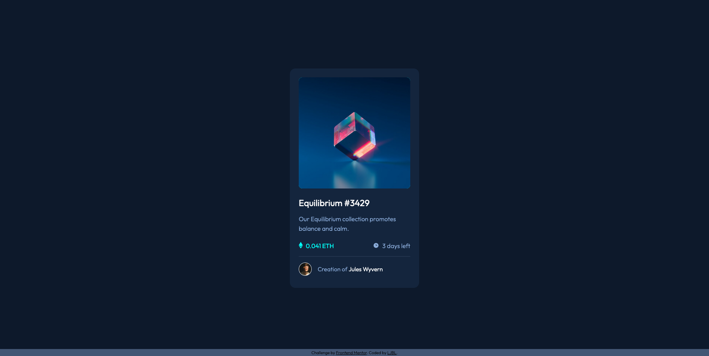

## Overview

### The challenge

Users should be able to:

- View the optimal layout depending on their device's screen size
- See hover states for interactive elements

### Screenshot



### Links

- Solution URL: [Solution](https://www.frontendmentor.io/challenges/nft-preview-card-component-SbdUL_w0U/hub)
- Live Site URL: [DEMO](https://ljbl22.github.io/frontend-mentor/nft-preview-card-component/)

## My process

### Built with

- Semantic HTML5 markup
- CSS custom properties
- Flexbox

### What I learned

- How to align two _inline elements_ such as img and text, simply by using `vertical-align: middle` on _both_ elements. Check [MDN](https://developer.mozilla.org/en-US/docs/Web/CSS/vertical-align#vertical_alignment_in_a_line_box) and [StackOverflow](https://stackoverflow.com/questions/489340/vertically-align-text-next-to-an-image) for further reference.

- figure out quicker about the relationship between background-image, two images order on HTML _(the later cover the former)_ as well as the css opacity & hover usage. Here are my codes.

  ```HTML
  <div class="card-img-container">
    
    
  </div>
  ```

  ```CSS
  .card-img-container {
    position: relative;
    width: 302px;
    height: 302px;
    margin-bottom: 1.5rem;
    border-radius: 10px;
    background-color: var(--cyan);
    opacity: 1;
    transition: opacity 0.3s;
    /* parent add this */
    cursor: pointer;
  }

  .card-img-container .view {
    position: absolute;
    top: 50%;
    left: 50%;
    transform: translate(-50%, -50%);
    opacity: 0;
    /* children add this  */
    pointer-events: none;
  }
  .card-img-container:hover .view {
    opacity: 1;
  }
  .card-img-container .cube {
    position: absolute;
    top: 0;
    left: 0;
    max-width: 100%;
    border-radius: 10px;
  }

  .card-img-container .cube:hover {
    opacity: 0.5;
  }
  ```
### \* 230202 Update\* What I learned 
It all started from a small question, I need to set border-radius property twice,
and in two different values (one was 10px, the other was 12px) in my original way.

By asking for suggestion, I tried a new way to improve my overlay, thanks to @vanzasetia. 

Here's the major difference: 
- use a tag as the container, and set up border-radius here only, plus with `overflow: hidden`
- use pseudo element with css properties including bg-color & bg-image
  - try `hsla` to set up the opacity back to color itself
- let the  to inherit the container size (by setting *display: block* to .cube !!)
- without setting up the four properties (top,right,bottom,left), the pseudo element just won't appear (because did not fill the background)
  - **[MDN](https://developer.mozilla.org/en-US/docs/Web/CSS/position):** 
    > Most of the time, absolutely positioned elements that have height and width set to auto are sized so as to fit their contents. However, non-replaced, absolutely positioned elements can be made to fill the available vertical space by specifying both top and bottom and leaving height unspecified (that is, auto). They can likewise be made to fill the available horizontal space by specifying both left and right and leaving width as auto.

  ```HTML
      <a href="#" class="main-img-container">
        
      </a>
  ```

  ```CSS
    /* main img */
    .main-img-container {
      position: relative;
      display: block;
      border-radius: 10px;
      overflow: hidden;
    }

    /* to avoid the line-height issue */
    .cube {
      display: block;
    }

    .main-img-container:hover::before {
      /* first hover, then pseudo element shows up! */
      content: "";
      display: block;
      /* Use hsla color format to control the opacity of the
          color */
      background-color: hsla(178, 100%, 50%, 0.5);
      background-image: url(./images/icon-view.svg);
      background-repeat: no-repeat;
      background-position: center;
      position: absolute;
      top: 0;
      left: 0;
      right: 0;
      bottom: 0;
    }
  ```


### Continued development

- improve my speed of layout, keep practicing!

## Author

- Website - [LJBL-REPO](https://github.com/LJBL22/frontend-mentor/tree/main/qr-code-component)
- Frontend Mentor - [@LJBL22](https://www.frontendmentor.io/profile/LJBL22)
- Twitter - [@LJBL2208](https://www.twitter.com/LJBL2208)

## Acknowledgments

Thank you **Frontend Mentor** :heart:

Thank you [@vanzasetia](https://www.frontendmentor.io/profile/vanzasetia) !
