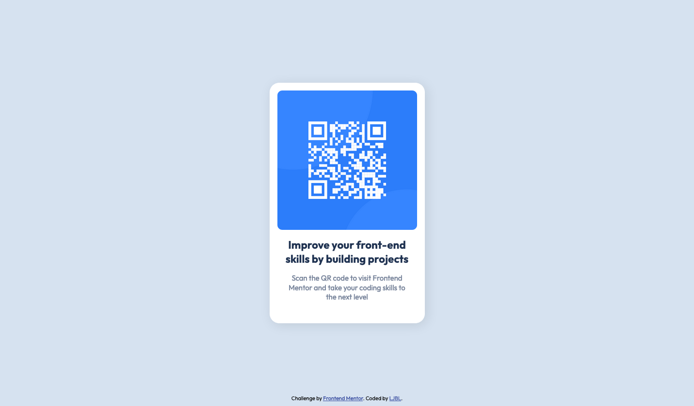

# Frontend Mentor - QR code component solution

This is a solution to the [QR code component challenge on Frontend Mentor](https://www.frontendmentor.io/challenges/qr-code-component-iux_sIO_H). Frontend Mentor challenges help you improve your coding skills by building realistic projects.

## Table of contents

- [Overview](#overview)
  - [Screenshot](#screenshot)
  - [Links](#links)
- [My process](#my-process)
  - [Built with](#built-with)
  - [What I learned](#what-i-learned)
  - [Continued development](#continued-development)
  - [Useful resources](#useful-resources)
- [Author](#author)
- [Acknowledgments](#acknowledgments)

## Overview

### Screenshot



### Links

- Solution URL: [Solution](https://www.frontendmentor.io/challenges/qr-code-component-iux_sIO_H)
- Live Site URL: [DEMO](https://ljbl22.github.io/frontend-mentor/qr-code-component/)

## My process

### Built with

- Semantic HTML5 markup
- CSS custom properties
- Flexbox

### What I learned

- revise and get to know the importance of CSS reset
- fix the situation that img overflow its container by this:

```css
img {
  max-height: 100%;
}
```

- 👀 the order: @import must show up before :root !

```css
@import url(//);

:root {
  //...
}
```

### Continued development

- ways to align images (background-image vs img)

### Useful resources

- [Josh Comeau - CSS Reset](https://www.joshwcomeau.com/css/custom-css-reset/) - the writing of this article is easy-to-read, I also enjoy his tone and small tricks of the website a lot!
- [figma](https://www.figma.com) - Wonderful figma, no wonder it was acquired :^)

## Author

- Website - [LJBL-REPO](https://github.com/LJBL22/frontend-mentor/tree/main/qr-code-component)
- Frontend Mentor - [@LJBL22](https://www.frontendmentor.io/profile/LJBL22)
- Twitter - [@LJBL2208](https://www.twitter.com/LJBL2208)

## Acknowledgments

ALPHA Camp classmates told me this cool front-end website :D Thank you!
